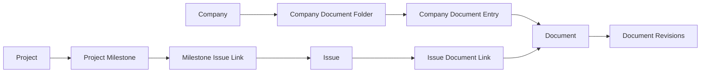

# Company Documents And Project Roadmap Plan

## Summary

Implement the manually managed MVP from `docs/brainstorms/2026-05-21-docs-roadmap-requirements.md`: a company-scoped Markdown document library and a project-scoped roadmap tab organized around milestones with linked backlog issues.

The plan keeps Paperclip's existing `documents` and `document_revisions` tables as the canonical text-document primitive. New work adds company-library placement and project-roadmap structure around those primitives instead of creating a parallel document system.

## Problem Frame

Issue documents already solve task-local planning and deliverables, but durable company knowledge is still hard to browse without opening old issues. Projects also have issue lists, but they lack a milestone-oriented view that shows the sequence of execution.

The MVP should make company memory and project execution visible without introducing automatic agent curation, a full knowledge-base product, or a Jira replacement.

## Origin Trace

- Company document browsing, folder organization, Markdown rendering, and manual editing cover the document-library requirements and the "browse company documents" flow.
- Project milestones, linked backlog issues, progress counts, and milestone management cover the roadmap requirements and the "maintain project roadmap" flow.
- Manual preservation of useful outputs remains intentionally manual in this plan. Agent-generated save proposals and automatic classification stay deferred.

## High-Level Technical Design

Use two small relation layers around existing primitives:



This preserves a single document body/revision model while allowing the same document primitive to appear in company-level library views and issue-level workflow views.

## Key Technical Decisions

- Reuse `documents` and `document_revisions` for company library documents. Rationale: issue documents already provide Markdown body storage, revision history, author fields, and locking behavior.
- Add explicit company document folder and placement tables instead of path-only strings. Rationale: folder rename/move should not rewrite every document row, and future source links can live on the placement.
- Add project milestones and a milestone-issue link table instead of adding a milestone field directly to `issues`. Rationale: roadmap membership can store ordering and can evolve without forcing all issue code paths to understand milestones.
- Keep the MVP board-operated. Rationale: the origin document deferred agent save proposals and automatic curation.

## Scope Boundaries

### In Scope

- Company Documents page with folder tree, Markdown preview, create/edit/rename/move/delete for folders and documents.
- Project Roadmap tab with milestone CRUD, milestone ordering, issue linking/unlinking, and status progress counts.
- Company boundary checks and activity log entries for document-library and roadmap mutations.
- Targeted server, shared-contract, and UI tests for the new feature-bearing surfaces.

### Deferred to Follow-Up Work

- Agent-generated document save proposals and approval flows.
- Automatic document classification, summarization, and cleanup.
- Agent-suggested roadmap or milestone restructuring.
- Company-wide roadmap across all projects.
- Rich document formats beyond Markdown.

### Non-Goals

- Replacing Notion, Jira, or an external knowledge base.
- Changing the core issue checkout or single-assignee execution model.
- Reworking goals into a roadmap system.

## Implementation Units

### U1. Data Model And Migrations

**Goal:** Add persistence for company document folders/library entries and project roadmap milestones/issue links.

**Primary files:**
- `packages/db/src/schema/company_document_folders.ts`
- `packages/db/src/schema/company_documents.ts`
- `packages/db/src/schema/project_milestones.ts`
- `packages/db/src/schema/project_milestone_issues.ts`
- `packages/db/src/schema/index.ts`
- `packages/db/src/migrations/*`

**Plan:**
- Add `company_document_folders` with `company_id`, `parent_id`, `name`, `position`, timestamps, and indexes for company/parent listing.
- Add `company_documents` with `company_id`, `document_id`, nullable `folder_id`, `title`, `position`, optional source context (`source_project_id`, `source_issue_id`), and timestamps.
- Add `project_milestones` with `company_id`, `project_id`, `title`, `description`, `status`, `target_date`, `position`, `archived_at`, and timestamps.
- Add `project_milestone_issues` with `company_id`, `project_id`, `milestone_id`, `issue_id`, `position`, and timestamps.
- Enforce uniqueness where practical: one library entry per document, sibling folder names per parent, and one roadmap milestone link per issue.
- Generate the migration through the repo's Drizzle workflow.

**Test scenarios:**
- Migration creates all four tables with expected indexes and foreign keys.
- Deleting a project cascades or removes its milestones and issue links without deleting issues.
- Deleting a company document entry does not delete unrelated issue document links unless the implementation deliberately deletes the shared document body.

### U2. Shared Types And Validators

**Goal:** Expose typed contracts for company documents and project roadmaps.

**Primary files:**
- `packages/shared/src/types/company-document.ts`
- `packages/shared/src/types/project-roadmap.ts`
- `packages/shared/src/validators/company-document.ts`
- `packages/shared/src/validators/project-roadmap.ts`
- `packages/shared/src/index.ts`
- `packages/shared/src/types/project.ts`

**Plan:**
- Add shared types for folders, company document entries, document payloads, milestone summaries, milestone detail rows, and milestone issue links.
- Add validators for folder/document create/update/move operations.
- Add validators for milestone create/update/reorder and issue link/unlink operations.
- Keep document `format` constrained to Markdown for this MVP.

**Test scenarios:**
- Folder/document validators reject empty names, invalid parent IDs, and non-Markdown formats.
- Milestone validators reject invalid status values, invalid dates, and issue link payloads without issue IDs.
- Shared exports are available to `server` and `ui` without deep imports.

### U3. Company Document Service And Routes

**Goal:** Provide board-accessible company document APIs backed by the existing document primitive.

**Primary files:**
- `server/src/services/company-documents.ts`
- `server/src/routes/company-documents.ts`
- `server/src/app.ts`
- `server/src/services/documents.ts`
- `server/src/__tests__/company-documents.test.ts`
- `server/src/__tests__/company-document-routes.test.ts`

**Plan:**
- Implement folder tree listing and document listing for a company.
- Implement create/update/delete for folders and company library documents.
- Treat company document deletion as removal from the company library by default. Physical `documents` cleanup is allowed only when the implementation proves no other links remain and covers that path with tests.
- Reuse document creation/revision behavior from `documentService` where possible; extract shared helpers from issue-document code only when it reduces duplication.
- Add optional source context fields so a company document can point back to a project or issue.
- Log activity for document-library mutations.
- Enforce company access on every read and mutation.

**API shape:**
- `GET /api/companies/:companyId/documents`
- `POST /api/companies/:companyId/document-folders`
- `PATCH /api/company-document-folders/:folderId`
- `DELETE /api/company-document-folders/:folderId`
- `POST /api/companies/:companyId/documents`
- `GET /api/company-documents/:entryId`
- `PATCH /api/company-documents/:entryId`
- `DELETE /api/company-documents/:entryId`

**Test scenarios:**
- Board user can create a folder, create a Markdown document inside it, update the document with `baseRevisionId`, and fetch the rendered-source payload.
- Stale document updates return `409` using the same optimistic-concurrency semantics as issue documents.
- Moving a document between folders updates only the library placement, not the document revisions.
- Cross-company folder/document access returns forbidden or not found consistently with existing route patterns.
- Deleting a folder with children is rejected unless the chosen implementation has an explicit recursive delete behavior.

### U4. Project Roadmap Service And Routes

**Goal:** Provide project-scoped milestone and backlog-link APIs.

**Primary files:**
- `server/src/services/project-roadmap.ts`
- `server/src/routes/projects.ts`
- `server/src/__tests__/project-roadmap.test.ts`
- `server/src/__tests__/project-roadmap-routes.test.ts`

**Plan:**
- Add service methods to list a project's roadmap with milestones, linked issues, and progress counts by issue status.
- Add milestone create/update/archive/reorder operations.
- Add issue link/unlink/reorder operations for backlog issues in the same project.
- Validate that linked issues belong to the milestone's project and company.
- Log activity for roadmap mutations.

**API shape:**
- `GET /api/projects/:id/roadmap`
- `POST /api/projects/:id/milestones`
- `PATCH /api/project-milestones/:milestoneId`
- `POST /api/projects/:id/milestones/reorder`
- `POST /api/project-milestones/:milestoneId/issues`
- `DELETE /api/project-milestones/:milestoneId/issues/:issueId`
- `POST /api/project-milestones/:milestoneId/issues/reorder`

**Test scenarios:**
- Roadmap listing returns milestones in position order with linked project issues.
- Progress counts update when linked issues have statuses such as `backlog`, `todo`, `in_progress`, `blocked`, and `done`.
- Linking an issue from another company or another project is rejected.
- Archiving a milestone hides it from the default roadmap list but does not delete linked issues.
- Reordering milestones or issue links persists stable ordering.

### U5. Company Documents UI

**Goal:** Add the company-level document library surface.

**Primary files:**
- `ui/src/pages/CompanyDocuments.tsx`
- `ui/src/api/companyDocuments.ts`
- `ui/src/lib/queryKeys.ts`
- `ui/src/components/Sidebar.tsx`
- `ui/src/App.tsx`
- `ui/src/pages/CompanyDocuments.test.tsx`

**Plan:**
- Add a Company sidebar item labeled `Documents`.
- Add a company-scoped route for the Documents page.
- Render a folder tree and selected document panel.
- Reuse `MarkdownBody` for preview and `MarkdownEditor` for editing.
- Provide create/rename/move/delete affordances for folders and documents with clear empty/error states.
- Invalidate company document queries after mutations.

**Test scenarios:**
- Documents nav item routes to the company-scoped Documents page.
- Folder tree renders nested folders and documents.
- Selecting a document shows rendered Markdown.
- Creating and editing a document sends Markdown payloads and refreshes the selected document.
- API errors are surfaced instead of silently failing.

### U6. Project Roadmap UI

**Goal:** Add a Roadmap tab to project detail.

**Primary files:**
- `ui/src/pages/ProjectDetail.tsx`
- `ui/src/components/ProjectRoadmapTab.tsx`
- `ui/src/api/projectRoadmap.ts`
- `ui/src/lib/queryKeys.ts`
- `ui/src/pages/ProjectDetail.test.tsx`
- `ui/src/components/ProjectRoadmapTab.test.tsx`

**Plan:**
- Add `roadmap` to the project tab resolver, route handling, tab cache, and route declarations.
- Render milestones as compact project planning columns or rows with status counts and linked issues.
- Provide create/edit/archive/reorder controls for milestones.
- Provide issue link/unlink controls using existing project issue data.
- Keep the UI operational and scan-friendly rather than marketing-like.

**Test scenarios:**
- `/projects/:projectId/roadmap` resolves to the Roadmap tab.
- Roadmap tab renders milestones and linked issue titles from API data.
- Creating and archiving a milestone invalidates roadmap queries.
- Linking an issue to a milestone updates the displayed issue list and progress counts.
- Empty project roadmap shows a useful empty state with an action to create the first milestone.

### U7. Search, Activity, And Documentation Follow-Through

**Goal:** Keep adjacent surfaces coherent without expanding the MVP.

**Primary files:**
- `ui/src/pages/Search.tsx`
- `server/src/services/activity-log.ts` or relevant activity callsites
- `doc/SPEC-implementation.md`
- `docs/brainstorms/2026-05-21-docs-roadmap-requirements.md`
- `docs/plans/2026-05-21-001-feature-docs-roadmap-plan.md`

**Plan:**
- Ensure company document mutations and roadmap mutations are visible in activity logs.
- Decide during implementation whether company documents should appear in existing company search immediately; if the existing search already indexes `documents`, include only library-visible documents in the UI treatment.
- Update implementation docs only where behavior has changed.
- Keep deferred automation clearly documented for later work.

**Test scenarios:**
- Activity log contains document-library create/update/delete entries.
- Activity log contains milestone create/update/archive and issue link entries.
- Search behavior is either explicitly supported for company-library documents or explicitly left unchanged without breaking existing document search.

## Sequencing

1. U1 data model and migration.
2. U2 shared contracts and validators.
3. U3 company document service/routes.
4. U4 project roadmap service/routes.
5. U5 company documents UI.
6. U6 project roadmap UI.
7. U7 adjacent surfaces and docs.

U3 and U4 can proceed in parallel after U1 and U2 if implemented by separate workers. U5 depends on U3. U6 depends on U4.

## Verification Plan

Run the smallest checks while implementing each unit, then the broader checks before PR-ready handoff.

- Database/schema: `pnpm --filter @paperclipai/db build` and `pnpm db:generate` after schema edits.
- Server tests: targeted Vitest runs for `company-documents`, `project-roadmap`, and existing `documents` tests.
- UI tests: targeted Vitest runs for `CompanyDocuments`, `ProjectDetail`, and `ProjectRoadmapTab`.
- Final PR-ready verification:

```sh
pnpm -r typecheck
pnpm test:run
pnpm build
```

## Risks And Mitigations

- Shared document body deletion could accidentally remove issue-visible content. Mitigation: make library deletion remove the company-library entry first; only garbage-collect a `documents` row when no issue or company-library links remain.
- Roadmap links could drift across company or project boundaries. Mitigation: validate company/project ownership in service methods, not only route handlers.
- The first UI could become too heavy. Mitigation: keep company documents as a two-pane file browser and roadmap as a scan-first milestone surface.
- Existing document service code is issue-oriented. Mitigation: extract only reusable document-revision helpers needed by company documents; avoid large refactors.

## Assumptions

- Board operators are the primary editors for this MVP.
- Agents do not automatically write to the company document library in this phase.
- One issue belongs to at most one project roadmap milestone at a time.
- Company documents are Markdown-only in the MVP even though the underlying document table has a generic `format` column.
